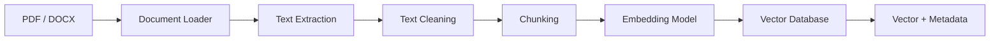
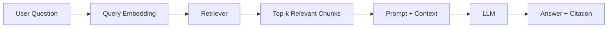
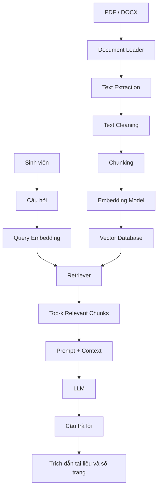

# Sơ đồ kiến trúc hệ thống chatbot RAG

## 1. Giai đoạn xây dựng kho tri thức

## 2. Giai đoạn hỏi đáp

## 3. Kiến trúc tổng thể

## 4. Mô tả

Hệ thống gồm hai luồng chính:

- Luồng xử lý tài liệu để xây dựng kho tri thức.
- Luồng hỏi đáp để truy hồi nội dung liên quan và cung cấp cho LLM.

Vector Database lưu embedding của các chunk cùng metadata như tên tài liệu và số trang.

Retriever tìm các chunk liên quan nhất đến câu hỏi của sinh viên.

LLM sử dụng câu hỏi và context được truy hồi để sinh câu trả lời kèm trích dẫn nguồn.
